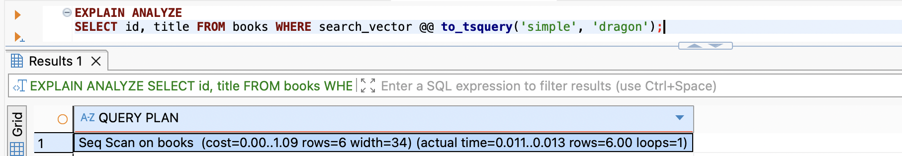
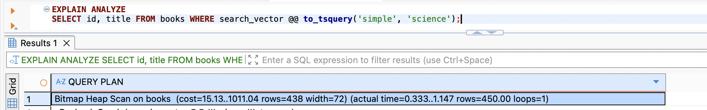

# MCP Integration Report

This report documents hands-on scenarios where an AI assistant (Claude Code) uses
**MCP (Model Context Protocol)** servers to work directly against live systems —
in this case a PostgreSQL database — instead of guessing from source code alone.

## Why MCP + AI

- **Ground truth, not guesses.** The AI reads real schema and runs real queries, so
  its explanations reflect what the database actually does — not what the code *looks*
  like it does.
- **Closed feedback loop.** The AI can seed data, run the production query, observe the
  output, and verify its reasoning in one continuous flow — no human copy-paste between tools.
- **Faster onboarding.** New engineers get demonstrations backed by executable evidence,
  turning "here's how it probably works" into "here's the exact number and why."
- **Safe & scoped.** Access mode is controlled per connection (read-only vs. unrestricted),
  so the same workflow can be tightened for production.

---

## Scenario 1 — Explaining search relevance `score` with live data

**Goal:** Understand how `GET /search/books` computes the `score` field, using real records.

### The scoring formula

From [`search.repository.ts`](src/search/search.repository.ts#L49-L50):

```
score = ts_rank_cd(title_vector, query) + 0.5 × ts_rank_cd(author_name_vector, query)
```

Key facts about the model:
- `search_vector` is a generated column built from **the title only**, weight `'A'`
  ([`db/schema.ts`](db/schema.ts#L52)): `setweight(to_tsvector('simple', title), 'A')`.
- The author name is tokenized on the fly at default weight `'D'`, and its contribution
  is **halved** (`0.5 ×`).
- `'simple'` text-search config = lowercase only, no stemming/stop-words.
  `plainto_tsquery` **AND**s all query terms.
- `ts_rank_cd` is *cover-density* ranking — default weights `{D:0.1, C:0.2, B:0.4, A:1.0}`,
  default normalization `0` (**no length penalty**; only term frequency and proximity matter).

### Demo data seeded via MCP

3 authors (one named **"Anne Dragon"** so the author-name branch fires) and 7 books
crafted to hit each branch of the formula.

### Query `q = dragon` (single term)

| Title | Author | title_rank | author part (×0.5) | **score** | Why |
|---|---|---|---|---|---|
| Dragon Dragon Dragon | George Martin | 3.0 | 0 | **3.0** | "dragon" appears 3× in a weight-A title → density sums to 3 × 1.0 |
| Dragon Tales | Anne Dragon | 1.0 | 0.05 | **1.05** | Title match (1.0) **plus** author "**Dragon**": `0.5 × 0.1` |
| Dragon | George Martin | 1.0 | 0 | **1.0** | One weight-A match |
| Red Dragon | Christopher Paolini | 1.0 | 0 | **1.0** | One match — title length doesn't matter |
| The Dragon Reborn | George Martin | 1.0 | 0 | **1.0** | One match, longer title, identical rank |
| The Red House And The Sleeping Dragon | Christopher Paolini | 1.0 | 0 | **1.0** | Still one match of "dragon" |
| The Art of Silence | **Anne Dragon** | 0.0 | 0.05 | **0.05** | **No title match** — found *only* via author name: `0.5 × 0.1` |

One query surfaces four distinct cases: **author-only (0.05)**, **plain title (1.0)**,
**title + author (1.05)**, and **repeated-term title (3.0)**.

### Query `q = red dragon` (two terms — proximity)

| Title | title_rank | **score** | Why |
|---|---|---|---|
| Red Dragon | 1.0 | **1.0** | Both terms **adjacent** → one tight cover → full density |
| The Red House And The Sleeping Dragon | 0.2 | **0.2** | Both terms present but **far apart** → density drops |

Same two matching words; `ts_rank_cd` rewards proximity. The other five books drop out
because they don't contain **both** "red" AND "dragon".

### MCP benefit illustrated

Without MCP, the AI could only *describe* the SQL. With MCP it **seeded records, ran the
exact repository query, and reported the real scores** — including the non-obvious results
(long titles scoring the same as short ones; the tiny 0.05 author-only hit). The explanation
is verified, not assumed.

---

## Scenario 2 — Watching the planner flip from Seq Scan to Bitmap Index Scan

**Goal:** The `books_search_idx` GIN index on `search_vector` exists, yet `EXPLAIN`
on a near-empty table shows a **Seq Scan** — the index looks "unused." Demonstrate
*why* that is correct, and find the exact row count where Postgres starts using the
index (a **Bitmap Index Scan**).

### The setup

```
CREATE INDEX books_search_idx ON public.books USING gin (search_vector);
-- search_vector is GENERATED: setweight(to_tsvector('simple', title), 'A')
```

The planner is a **cost optimizer**, not a "use the index if it exists" machine. For
every query it estimates each plan's cost and picks the cheapest:

- **Seq Scan** — startup cost `0.00`, then ~`pages × seq_page_cost + rows × cpu_cost`.
  A straight line that starts at zero.
- **Bitmap Index Scan** — a real **startup cost**: descend the GIN structure, walk the
  posting list for the matched lexeme, and build an in-memory bitmap *before any heap
  row is read*. High to start, then rises slowly.

The two cost curves cross only once the table is big enough that reading *every* page
costs more than paying the GIN startup plus fetching only the matching rows.

### Sweep run live via MCP (selective term, ~1% of rows match)

| Rows | Seq Scan cost | Plan chosen |
|------|--------------:|-------------|
| 7 (original) | 15.62 | Seq Scan |
| 1,000 | 51.50 | Seq Scan |
| 10,000 | 509.00 | Seq Scan |
| 30,000 | 1,527.00 | Seq Scan |
| 40,000 | 2,036.00 | Seq Scan |
| **45,000** | — | **Bitmap Index Scan** ✅ |

**The tipping point is ~42–45k rows** for this table (row width + ~1% selectivity).
Below it, scanning the whole table is genuinely cheaper than using the index — so a
`Seq Scan` on a small table is the index working as intended, not a misconfiguration.

### Proof — same query, two table sizes

**Few rows → Seq Scan** (`cost=0.00..1.09`, a single page):



**45,007 rows → Bitmap Index Scan** (`cost=15.13..1011.04`, actual `rows=450`):



Same index, same schema, same query shape — only the row count changed, and the planner
flipped its decision.

### Bonus bug caught by the closed feedback loop

The first `EXPLAIN` at 45k rows used the index but returned **0 rows**. The reason is a
**text-search config mismatch**:

- The generated column uses the **`'simple'`** config (lowercase only, no stemming), so
  it stores the lexeme `'science'`.
- An initial query used `to_tsquery('english', 'science')`, which **stems** to `'scienc'`.
  `'scienc' ≠ 'science'` → the index is scanned but matches nothing.
- Fix: query with the **same** config the index uses — `to_tsquery('simple', 'science')`.

The application code consistently uses `'simple'` (see [`db/schema.ts`](db/schema.ts#L52)),
so production is correct; the mismatch was purely in the ad-hoc query. **Lesson: the query
and the index must share a text-search configuration, or the index "works" while silently
returning nothing.**

### MCP benefit illustrated

Without MCP this is hand-wavy ("big tables use the index"). With MCP the AI **seeded data
incrementally, re-ran `EXPLAIN ANALYZE` at each size, read the real cost numbers, and
located the exact crossover (~42–45k rows)** — then caught a real config-mismatch bug from
the live `rows=0` result. The conclusion is measured, not assumed.`

---

<!-- Additional scenarios will be appended below. -->

---

## Why the Postgres MCP Helps — Capabilities & Advantages

The scenarios above are concrete demos. This section generalizes them into the
recurring, high-value ways a Postgres MCP server (the `crystaldba/postgres-mcp`
server wired into this repo) earns its place in an AI-assisted workflow.

### Ground-truth & drift detection

- **Code-vs-reality schema diff.** The AI reads the *live* catalog
  (`list_objects`, `get_object_details`) and compares it against the schema declared in
  code (`db/schema.ts`). It surfaces drift the compiler can't see:
  a column that exists in code but not in the DB (or vice-versa), a missing/extra index,
  a `NOT NULL`/default that diverged, a type that was widened in one place only.
- **Migration auditing.** Check whether every migration was actually applied, whether the
  live DDL matches what the migration *intended*, and whether the running database version
  matches what the migration files target — catching "applied locally, forgotten in staging"
  classes of bugs.
- **Constraint & FK reality check.** Confirm that foreign keys, unique constraints, and
  check constraints the code *assumes* are truly enforced in the database, not just in
  application logic.

### Performance & health intelligence

- **Index tuning.** `analyze_workload_indexes` / `analyze_query_indexes` explore many
  candidate indexes and recommend the set that best fits the real workload — backed by
  cost-benefit analysis, not intuition.
- **Hypothetical "what-if" indexes.** `explain_query` can simulate an index via `hypopg`
  *before* you create it — measure the predicted speedup with zero write cost or lock risk.
- **Plan validation.** Read real `EXPLAIN (ANALYZE)` output to confirm the planner uses
  the index you expect (see Scenario 2 — Seq Scan vs. Bitmap Index Scan).
- **Database health checks.** `analyze_db_health` reports on index bloat, buffer-cache hit
  ratio, vacuum/autovacuum health, connection utilization, sequence-exhaustion risk,
  replication lag, and transaction-ID wraparound — the same signals an SRE watches.
- **Slow-query surfacing.** `get_top_queries` ranks the most expensive statements
  (via `pg_stat_statements`) so optimization effort lands where it actually matters.

### Safety model — why `--access-mode` matters

- **`restricted` mode** wraps work in **read-only transactions** and caps resource usage by
  parsing and constraining the SQL. This is the default for anything pointed at production:
  the AI can *read, explain, and diagnose* but **cannot mutate or drop** data.
- **`unrestricted` mode** grants full read/write/DDL — appropriate only for throwaway dev
  databases.
- **Operationally important:** switching `--access-mode` in `.mcp.json` requires
  **restarting the MCP connection / chat session**. That friction is a *feature* — it makes
  enabling destructive access a deliberate, explicit act, so a prod database **cannot be
  wiped by an offhand prompt**. The safe state is sticky by default.

### Popular, "smart" use cases (industry patterns)

- **Schema-drift CI gate** — an agent diffs live schema against the ORM/migrations on every
  PR and flags divergence before it reaches prod.
- **AI-driven index advisor** — feed the top slow queries to the MCP and let it propose,
  simulate (`hypopg`), and benchmark indexes before a human commits the migration.
- **Onboarding & data-model Q&A** — new engineers ask "how does X work?" and get answers
  backed by the *actual* tables, constraints, and row counts, not stale docs.
- **Pre-deploy health snapshot** — run `analyze_db_health` as a release checklist step to
  catch bloat / wraparound / vacuum debt before it becomes an incident.
- **Natural-language read-only analytics** — analysts query production safely in plain
  English while `restricted` mode guarantees nothing can be written.
- **Capacity & risk monitoring** — periodic checks on sequence limits, connection pools, and
  replication lag, summarized in human-readable form.

---

## MCP vs. CLI (`psql`-in-Docker): Why MCP Is Better, Safer, and Often Cheaper

A natural alternative to an MCP server is shelling out — `docker exec ... psql -c "..."`.
It works, but for an *AI* consumer the MCP path wins on the axes that matter. Theses below
combine the project's own experience with published function-calling research.

### Signal, not noise (token economy)

- **Structured JSON over scraped text.** MCP tools return typed, structured results the model
  consumes directly. CLI output is human-formatted text (ASCII tables, banners, NOTICE/WARNING
  lines, psql prompts, connection chatter) that the model must *re-parse* — burning tokens on
  formatting it will then discard.
- **Less prompt pollution.** A `psql` table for a wide result is mostly box-drawing characters
  and padding. The same data as JSON is denser and unambiguous, so more *actual information*
  fits in the context window per token.
- **No shell/quoting boilerplate.** CLI calls carry `docker exec`, flags, connection strings,
  and nested-quote escaping in *both* the request and (echoed) response. MCP arguments are a
  clean schema-validated object — fewer tokens, fewer ways to get it wrong.
- **Higher information density of purpose-built tools.** One `analyze_db_health` call returns a
  structured health report; reproducing it via CLI means many separate queries, each with its
  own noisy text dump to parse and stitch together.

### Reliability & correctness

- **Schema-constrained calls beat free-text parsing.** Free-text action strings (the CLI style)
  are prone to hallucination and format errors, whereas JSON-Schema function calling
  constrains action generation to structured schemas. The model fills typed parameters instead
  of hand-assembling a shell line.
- **Capability discovery is explicit.** The MCP advertises exactly which operations exist with
  formal schemas, reducing "fabricated tool / wrong flag" errors common when an agent free-hands
  CLI invocations.
- **Deterministic parsing.** JSON parses the same way every time; CLI text formatting varies with
  psql settings (`\pset`, locale, `NULL` display, pager), so brittle text-scraping silently breaks.
- **Fewer round-trips on failure.** Typed errors come back as structured fields instead of a
  stderr blob the model must interpret, so it recovers in fewer turns.

### Safety

- **Enforced access policy.** `restricted` mode guarantees **read-only transactions** at the
  protocol layer — a guarantee a raw `psql` shell (which can run `DROP`/`DELETE`/`TRUNCATE`)
  does not provide. Switching to write access requires an explicit config change *and* a session
  restart (see above).
- **Smaller blast radius.** MCP exposes a curated, named set of operations; a CLI exposes the
  entire surface of the shell *and* the database at once.

### Cost & operational efficiency

- **Fewer tokens → lower cost & latency.** Because requests and responses are compact and
  structured (no formatting noise, no shell boilerplate), the same task consumes fewer tokens —
  directly cheaper per call and faster to process.
- **Less context saturation.** Noisy CLI dumps crowd the context window and degrade tool-call
  accuracy in multi-step workflows; lean JSON keeps the window focused on the task.
- **Standardized & portable.** One MCP interface works across clients and models; CLI glue is
  bespoke per environment and must be re-debugged whenever the container, flags, or formatting
  change.

> **Caveat (honest trade-off):** an MCP server's tool schemas cost some context tokens to load
> up front. Here that cost is small — this Postgres MCP exposes only **9 tools** — so the net win
> comes almost entirely from *per-call* savings and reliability on data-heavy, multi-step database
> work — exactly the workload in this report.
